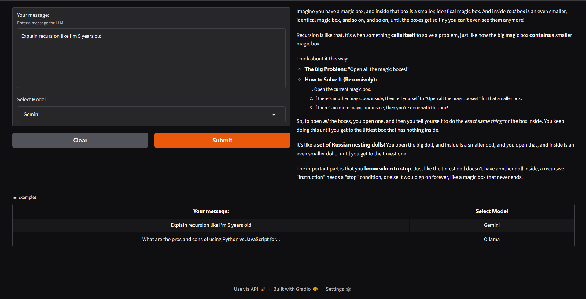

# Gradio Chat Interface — Gemini & Ollama

A local chat interface built with **Gradio** that lets you switch between **Gemini 2.5 Flash Lite** (via Google API) and **Gemma3** (via Ollama locally) — all from a clean web UI with real-time streaming.

## Demo
 


## How it works

1. You type a message and select a model (Gemini or Ollama)
2. The request is routed to the appropriate backend — Google's API or your local Ollama instance
3. The response streams back token by token, rendered as Markdown in the UI

## Setup

```bash
# 1. Install Ollama: https://ollama.com
# 2. Pull the local model
ollama pull gemma3

# 3. Install Python dependencies
pip install openai gradio python-dotenv

# 4. Add your Google API key to a .env file
echo "GOOGLE_API_KEY=your_key_here" > .env

# 5. Run
interface.ipynb
```

## Usage

Launch the notebook and a Gradio interface opens in your browser at a localhost like `http://127.0.0.1:7862`.

- **Your message** — type any question or prompt (7-line text box)
- **Select Model** — choose `Gemini` (cloud) or `Ollama` (local)
- Hit **Submit** and watch the response stream in as Markdown

### Example Prompts

| Prompt | Model |
|---|---|
| Explain recursion like I'm 5 years old | Gemini |
| What are the pros and cons of Python vs JavaScript for backend? | Ollama |

## Key Concepts

- **Unified OpenAI-compatible API:** Both Gemini and Ollama are accessed using the `openai` Python client — just with different `base_url` values. No extra SDKs needed.
- **Streaming:** Responses are yielded chunk by chunk using Python generators, giving a typewriter effect in the UI.
- **Model routing:** `stream_choose()` dispatches to the right backend based on the dropdown selection.
- **Gradio Interface:** Built with `gr.Interface` — text input, dropdown model selector, and Markdown output, with built-in examples and no flagging.