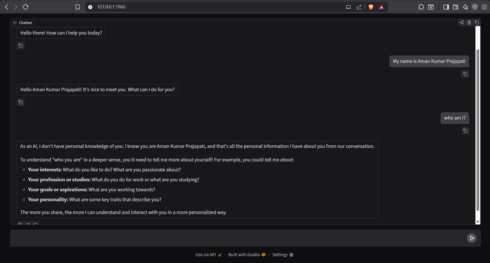

# Gemini Chatbot — Multi-turn Conversation with Gradio

A conversational chatbot powered by **Gemini 2.5 Flash Lite** with full **chat history support**, built using Gradio's `ChatInterface` — no extra UI code needed.

## Demo


## How it works

1. You type a message in the chat UI
2. The full conversation history is passed to Gemini on every turn so it remembers context
3. The response streams back in real time

## Setup

```bash
# 1. Install dependencies
pip install openai gradio python-dotenv

# 2. Add your Google API key to a .env file
echo "GOOGLE_API_KEY=your_key_here" > .env

# 3. Run
chatbot.ipynb
```

## Usage

Launch the notebook and a Gradio chat window opens at `http://127.0.0.1:7860`. Just start typing — it works like any chat app and remembers everything said in the session.

## Key Concepts

- **Conversation history:** On each message, the full chat history is included in the API call so Gemini maintains context across turns.
- **Streaming:** Responses are yielded chunk by chunk via a Python generator for a smooth, real-time feel.
- **`gr.ChatInterface`:** Gradio's built-in chat component handles the entire UI — message bubbles, history display, and input box — in a single line.
- **OpenAI-compatible client:** Gemini is accessed using the `openai` Python SDK, just pointed at Google's API endpoint.